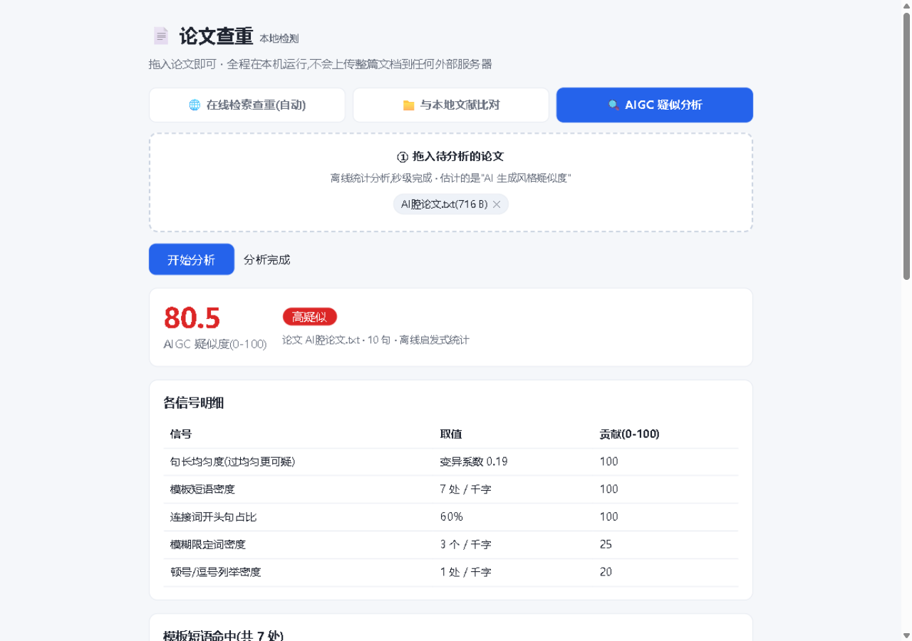
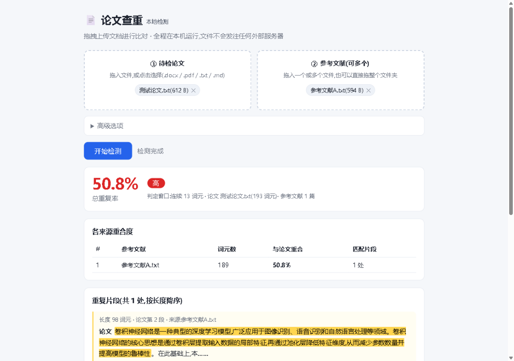

# 📄 论文查重工具(Paper Plagiarism Check)v2.0

一个**纯本地运行**的论文查重 + AIGC 疑似度分析工具,基于 Python 标准库实现(零第三方依赖),提供拖拽式网页界面。



**🌐 在线演示(GitHub Pages,打开即用):[https://zhang-rgb-r.github.io/paper-plagiarism-check/](https://zhang-rgb-r.github.io/paper-plagiarism-check/)**

## 🆕 v2.0:对齐知网检测维度

- **三大指标**:总文字复制比 / **去除引用文献后复制比**(主指标)/ 引用率
- **引用识别**:标注了 `[1]` 引文标记或引号包裹的重复内容归为"合理引用",与抄袭分开统计
- **文献列表识别**:文末参考文献部分的重合单独归类
- **分章节复制比**:按章节标题自动划分,逐章给出复制比(降序)
- **模糊匹配(改写检测)**:在线渠道对候选文献摘要做 3-gram 相似度比对(≥35%),抓轻度改写,单独列为"疑似改写"需人工确认
- **新增 arXiv 学术源**(英文论文)
- ⚠️ 检测**维度**对齐知网,但**数据库覆盖无法等同**(知网为独家授权库),详见文末如实说明

## ✨ 三种模式

| 模式 | 说明 | 是否需要联网 |
|---|---|---|
| 🌐 在线检索查重 | 只需拖入论文。自动切句后逐句到 OpenAlex / Europe PMC / arXiv / 搜索引擎检索出处,命中后抓取原文**逐字核验 + 模糊匹配** | ✅ |
| 📁 与本地文献比对 | 拖入论文 + 参考文献/往稿/文件夹,基于 k 连续词元窗口做本地比对,输出三大指标与分章节复制比 | ❌ |
| 🔍 AIGC 疑似分析 | 离线启发式统计,估计"AI 生成风格疑似度"(0-100),逐句彩色标注 | ❌ |



## 🚀 快速开始

**环境要求**:Python 3.8+(仅标准库;.pdf 支持需额外 `pip install pypdf`)。没有 Python 的话,先去 [python.org](https://www.python.org/downloads/) 安装。

```bash
# 可选:如需读取 PDF 文献,安装 pypdf(.docx/.txt/.md 无需任何依赖)
pip install pypdf

# 启动网页版(自动打开浏览器,默认 http://127.0.0.1:8765)
python scripts/webapp.py
```

Windows 用户可直接双击 [`start_web.bat`](start_web.bat)。

命令行方式:

```bash
python scripts/check_plagiarism.py --paper 论文.docx --refs 文献目录/ 旧稿.txt \
    --out 查重报告.md --html 查重报告.html --json 查重结果.json
```

### 安装到你的 AI 编程助手(任何 Agent AI 通用)

本技能遵循 **Agent Skills 开放规范**(SKILL.md),任何支持该规范的 AI 编程工具都能直接使用——ZCode、Claude Code、Cursor、Codex CLI 等。

1. 获取本仓库:`git clone` 本仓库,或点 **Code → Download ZIP**。⚠️ 用 ZIP 的话解压出的文件夹叫 `paper-plagiarism-check-main`,**必须重命名为 `paper-plagiarism-check`**(技能名与文件夹名一致才能被发现;git clone 的无需改名)
2. 把文件夹放进你的工具的技能目录,常见位置:
   - **ZCode**:`~/.agents/skills/paper-plagiarism-check/`(Windows 即 `C:\Users\你的用户名\.agents\skills\`),或项目级 `<项目>/.zcode/skills/`
   - **Claude Code**:`~/.claude/skills/paper-plagiarism-check/`
   - **其他工具**:查阅该工具文档里 "skills" 的目录约定,把文件夹原样放进去即可
3. 重启工具或新开会话,直接说"帮我给这篇论文查重"即可自动触发

不想装成技能也行——**脚本本身可以独立使用**:任何能执行命令的 AI 助手都可以直接运行 `python scripts/webapp.py` 启动网页版,或调用 `scripts/check_plagiarism.py` 完成查重,无需任何技能机制。社区安装器(如 `npx skills add Zhang-rgb-r/paper-plagiarism-check`)通常也能自动装进它支持的多个工具。

## 🔍 检测原理

- **本地比对**:中文逐字、英文按词切分为"词元"序列,归一化(忽略大小写/全半角/空白/标点)后,凡与参考文献存在 k 个连续相同词元(默认中文 13、英文 6)即计为重复,合并为最大片段。这是常见"连续 13 字判重"思路的本地实现。
- **引用识别(v2)**:重复片段若含 `[n]` 引文标记、引号包裹,或出现在文末参考文献列表中,归为"引用/文献列表",不计入主复制比。
- **在线检索**:论文切句 → [OpenAlex](https://openalex.org)(约 2.5 亿篇文献题录摘要)/ [Europe PMC](https://europepmc.org)(开放获取全文)/ [arXiv](https://arxiv.org) / 搜索引擎(360/搜狗/Bing)检索候选 → 抓取原文逐字核验,只把核验通过的计入重复率。
- **模糊匹配(v2)**:在线渠道对候选文献摘要做句级 3-gram 相似度(≥35% 判为疑似改写),单独列出供人工确认;能抓轻度改写,深层语义改写仍需语义模型。
- **AIGC 疑似度**:句长均匀度(burstiness)、模板短语密度、连接词开头句占比、模糊限定词密度、列举密度五项信号的加权启发式评分。

## ⚠️ 如实说明(重要)

- **关于"接近知网"**:v2.0 对齐了知网的检测**功能维度**(连续字符匹配、引用分离、三大指标、分章节复制比、模糊匹配),但知网的准确率来自其**独家授权的亿级文献库**,任何开源工具都无法获取同等数据。因此本工具的结果是"与开放数据源 / 自选文献的重合度",**数值上不可能等同知网**。
- 开放数据源**无法访问知网/万方/维普等商业库的授权全文**;网页检索受搜索引擎排序限制,是尽力检索。
- 逐字重复与小句级重复可检出;**轻度改写**由模糊匹配单独提示(需人工确认);深层语义改写、中英互译后的雷同无法检出。
- AIGC 疑似度是启发式统计,不构成 AI 写作的证明:人写的模板化文章也会得分,AI 写的朴素句子也可能低分,商用检测系统同样存在误判。
- 全程本地运行,默认只监听 127.0.0.1;在线模式只会把"句子片段"发送给公开检索数据源,不会上传整篇文档。

## 📂 目录结构

```
├── README.md
├── SKILL.md                 # ZCode 技能定义
├── start_web.bat            # Windows 一键启动
├── scripts/
│   ├── webapp.py            # 网页版(纯标准库 HTTP 服务)
│   ├── check_plagiarism.py  # 检测核心 + 命令行入口
│   ├── online_check.py      # 在线多源检索
│   └── aigc_check.py        # AIGC 启发式分析
└── docs/                    # 截图
```

## License

[MIT](LICENSE)
